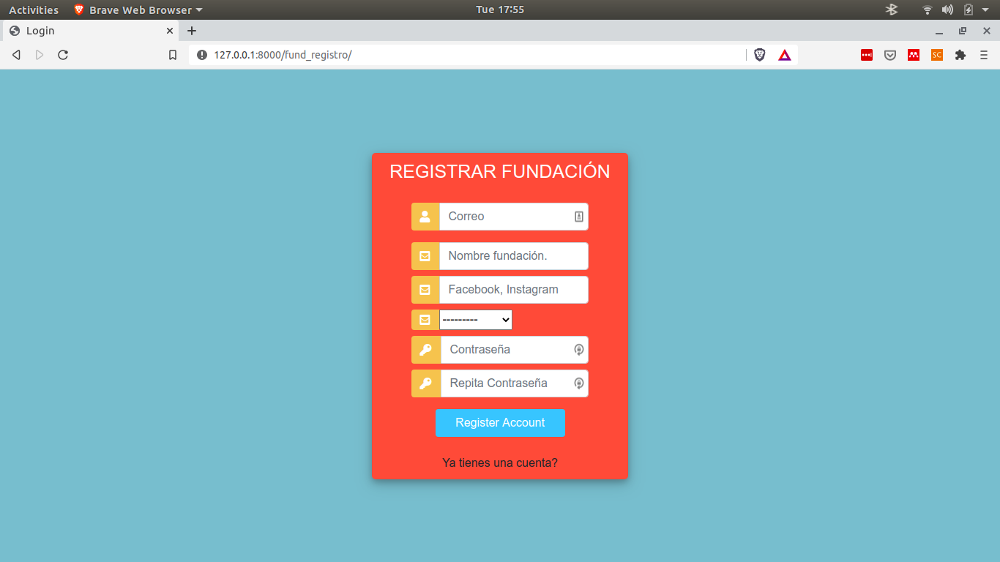

# Mascotas App
> Este repositorio alberga la aplicación hecha en django de una app para mostrar las mascotas de una fundación

## Table of contents
* [General info](#general-info)
* [Screenshots](#screenshots)
* [Technologies](#technologies)
* [Setup](#setup)
* [Features](#features)
* [Status](#status)
* [Inspiration](#inspiration)
* [Contact](#contact)

## Screenshots

