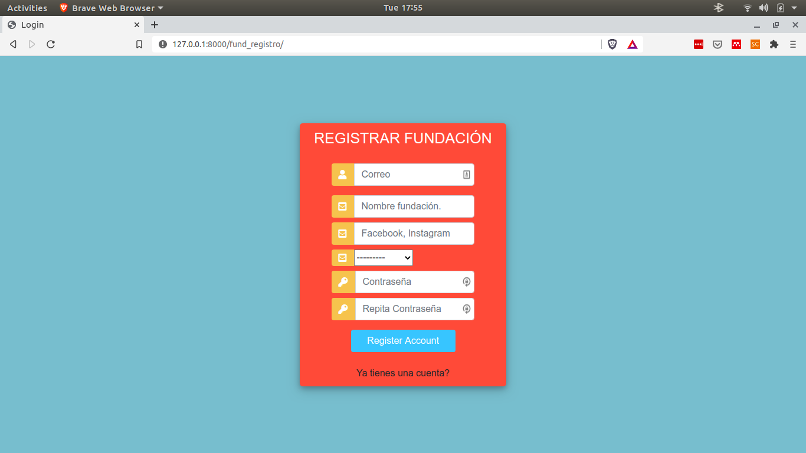

# Mascotas App
> Este repositorio alberga la aplicación hecha en django de una app para mostrar las mascotas de una fundación

## Indice
* [Información General](#general-info)
* [Screenshots](#screenshots)
* [Tecnologias](#tecnologias)
* [Instalación](#setup)
* [Caracteristicas](#caracteristicas)
* [Estado](#estado)
* [Inspiración](#inspiration)
* [Contacto](#contact)

## Screenshots

## Tecnologias
Para este proyecto se usaron las siguientes tecnologias
* Django - version 3.2.0
* Postgres - version 10.14

## Caracteristicas
Caracteristicas listas por el momento
* Registro e inicio de sesión para adoptantes
* Registro e inicio de sesión para fundaciones
* Agregar o eliminar mascotas
* Visualizar mascotas
* Añadir mascota a favoritos

## Estado
El proyecto se encuentra en: _en_producción_ en un servidor hosteado por Heroku

Prueba la aplicación [TinderPet](https://stark-stream-31493.herokuapp.com/log/)- Cualquier error o bug sientete libre de reportarlo!

